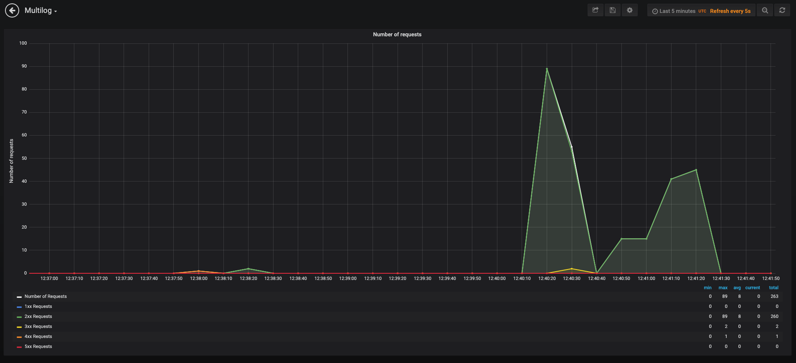

# Express-influx-multilogger

An Express middleware for better monitoring of your Node.js apps.
Parse important req, res and header objects to Influx and Grafana. Get an easier insight of your API without any costs.

**Note:** this is in _active_ development, and could contain bugs. Please make an issue if you find some.

## Getting started

### Installation

1. Install package
   *  Npm
   ```
   npm install express-influx-multilogger
   ```
   *  Yarn
   ```
   yarn add express-influx-multilogger
   ```
2. Require
   ```
   const multilogger = require('express-influx-multilogger');
   ```
3. (Required if you want to write to influx) Initialize database in your app.js
   ```
   multilogger.init({
    database: {
        server: "127.0.0.1",
        name: "myMultilogDb",
        port: 8086
         },
    interval: 10000
   });
   ```
4. Add multilogger log function right before your router of choice
   ```
   app.use(multilogger.log({ development: false, extended: false }));
   ```
5. Add multierror function before catching 404 and after your router
   ```
   app.use(multilogger.error());
   ```
6. In case of using geolocation, make sure your server can make use of req.connection.remoteAddress

### Example

```
const express = require("express");
const bodyParser = require("body-parser");
const cookieParser = require("cookie-parser");
const multilogger = require('express-influx-multilogger'); // Add this to imports

const indexRouter = require("./routes/index");

//  Add this to write data to influx (not required)
multilogger.init({
    database: {
        server: "127.0.0.1",
        name: "myMultilogDb",
        port: 8086
         },
    interval: 10000 //  Write to Influx every 10 seconds
});

const app = express();

app.use(bodyParser.urlencoded({ extended: true }));
app.use(bodyParser.json());
app.use(cookieParser());

// Add this before your router of choice
app.use(multilogger.log({ development: false, extended: false }));

app.use("/", indexRouter); // Your router

// Add this before 404 if you want to capture your errors as well
app.use(multilogger.error());

module.exports = app;
```

### Loggable headers

The data being sent to Influx consists of ...

#### Fields

...logs of the amount of calls per statuscode per given interval

```
    amountOf1xx: Influx.FieldType.INTEGER,
    amountOf2xx: Influx.FieldType.INTEGER,
    amountOf3xx: Influx.FieldType.INTEGER,
    amountOf4xx: Influx.FieldType.INTEGER,
    amountOf5xx: Influx.FieldType.INTEGER
```

...logs of Response Time, CPU and memory Usage of the OS, host and ip;

```
    responseTime: Influx.FieldType.FLOAT,
    cpuUsage: Influx.FieldType.FLOAT,
    memoryUsage: Influx.FieldType.FLOAT,
    requests: Influx.FieldType.INTEGER,
    host: Influx.FieldType.STRING,
    ip: Influx.FieldType.STRING
```

#### Tags

...logs of basic headers to Influx

```
    "statusCode",
    "statusMessage",
    "method",
    "path",
    "url",
    "ip",
    "country",
    "geohash", // Used to get the geolocation of your api call from a given IP
    "client",
    "body",
    "query",
    "params",
    "auth", // In case you wanna know wich user that triggered the api call
    "errorMessage", // In case of an error: sends message and stack
    "errorStack"
```

### Parameters

1. Extended: Logs a pretty view of req, res and headers (defaults false)
2. Development: Logs the object that Influx will recieve
3. Database:
   - server: The address of your Influx database. _(defaults: 127.0.0.1)_
   - name: Name of your Influx database. _(defaults: myMultilogDb)_
   - port: Port of your Influx database. _(defaults: 3000)_
   - username: Login credentials of your Influx database. _(defaults: '')_
   - password: Password of your Influx database. _(defaults: '')_
4. Interval: Defines the rate in ms of the interval you want to write your data to your Influx database

### Grafana

<br>


If you want to use Grafana and don't want to write your dashboard, you can import
[the dashboard JSON](./grafanaDashboard.json). You can certainly write your own dashboard, as I'm not that skilled with Grafana.

By using this dashboard, make sure you install [the worldmap plugin](https://grafana.com/plugins/grafana-worldmap-panel). 


## License

Distributed under the MIT License. See `LICENSE` for more information.

## Dependencies

- [systeminformation](https://github.com/sebhildebrandt/systeminformation)
- [lodash](https://lodash.com/)
- [node-influx](https://www.npmjs.com/package/influx)
- [ngeohash](https://www.npmjs.com/package/ngeohash)
- [iplocation](https://www.npmjs.com/package/iplocation)

## Contributors

- [Michiel Cuvelier](https://github.com/cuvelierm)
